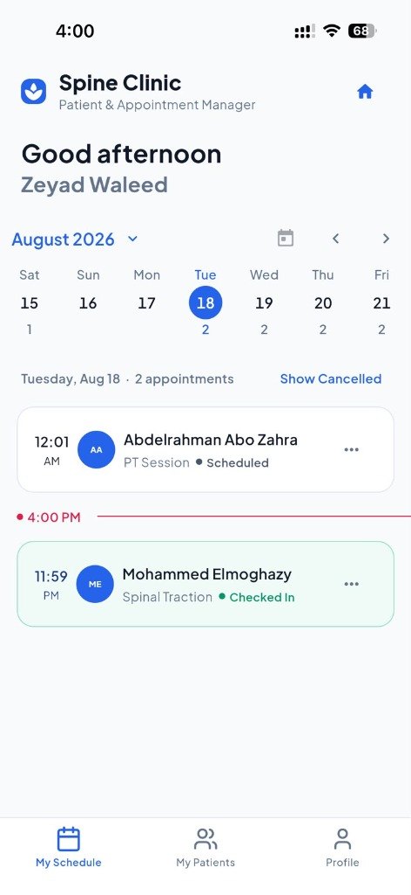
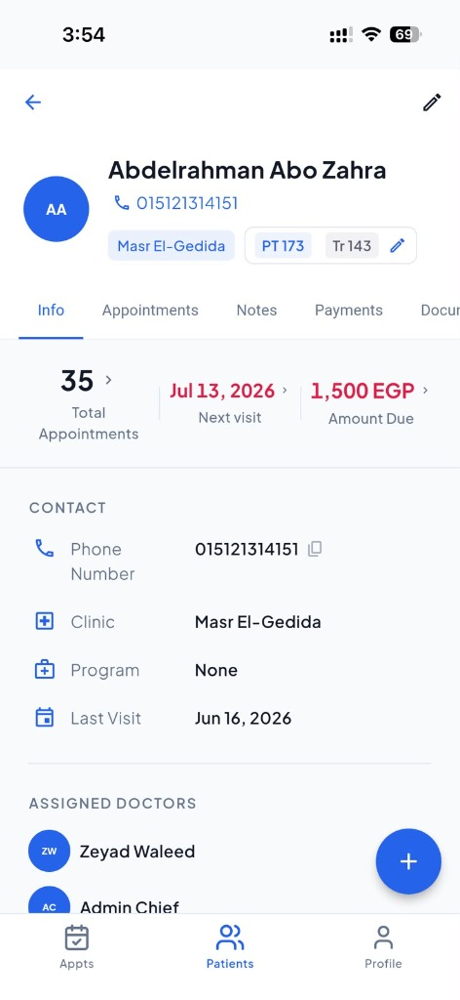
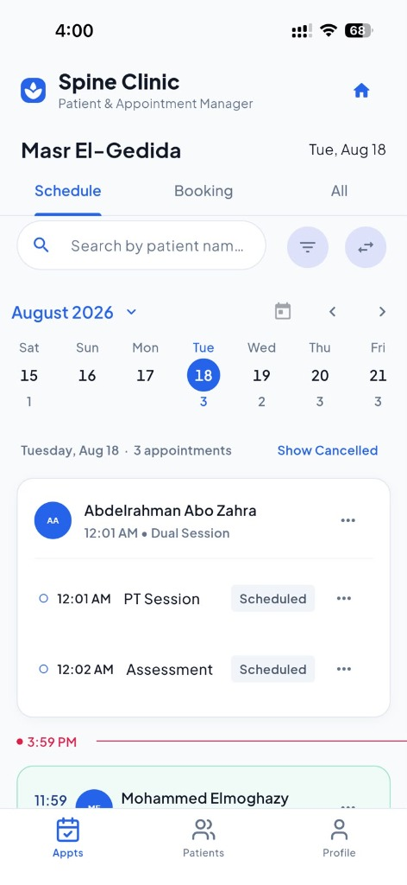
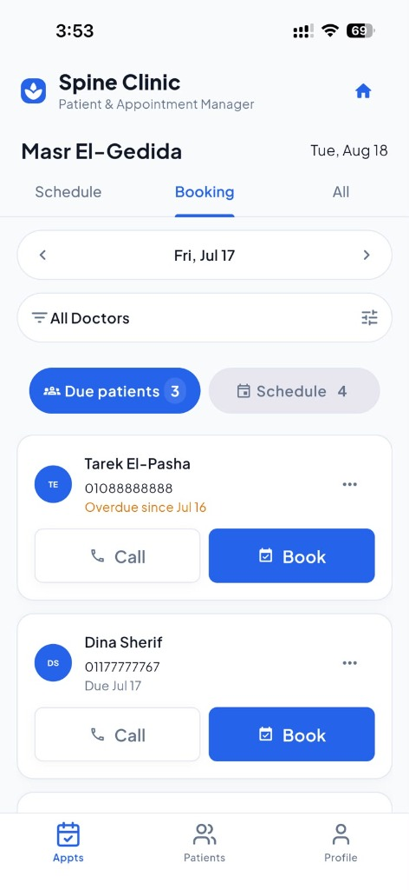
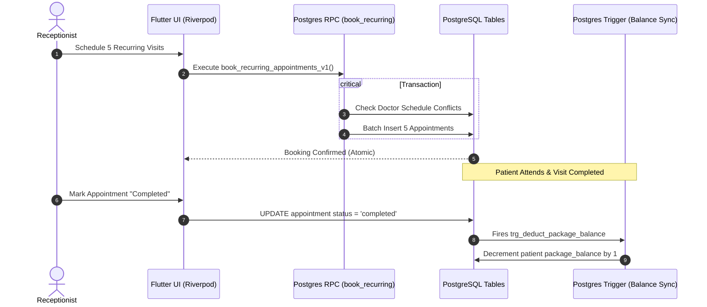

<div align="center">

# 🏥 The Spine Clinic
### **Enterprise Clinical Operations & Patient Management System**

An enterprise-grade, multi-role medical clinic management platform engineered with **Flutter**, **Riverpod**, and **Supabase (PostgreSQL)**. Designed for real-world healthcare operations, featuring strict **Clean Architecture**, database-level transactional integrity, and role-based access control (RBAC).

[](https://spine-clinic-app.web.app/)
[](https://flutter.dev)
[](https://riverpod.dev)
[](https://supabase.com)
[](https://www.linkedin.com/in/sagy-tamer/)

[🚀 Live Web App](https://spine-clinic-app.web.app/) •
[📱 UI Preview](#-application-preview) •
[🏛️ Architecture](#-system-architecture) •
[💎 Engineering Highlights](#-outstanding-engineering-highlights) •
[🔒 Database & Security](#-database--security-engineering) •
[🛠️ Tech Stack](#-tech-stack) •
[👨‍💻 Author](#-author--connect)

</div>

---

## 🚀 Live Interactive Demo

Experience the full multi-role platform directly in your browser:

👉 **[Launch Live Web Application (spine-clinic-app.web.app)](https://spine-clinic-app.web.app/)**

---

## 📱 Application Preview

<div align="center">

| Doctor Workstation | Longitudinal Patient Dossier |
| :---: | :---: |
|  |  |
| *Real-time queue, timeline indicator, & check-in status* | *Longitudinal stats, financial dues, & clinical sub-tabs* |

| Receptionist Schedule Matrix | Due & Overdue Patients Queue |
| :---: | :---: |
|  |  |
| *Multi-slot booking, dual sessions, & 300ms debounced search* | *One-tap patient call & rapid booking recovery* |

</div>

---

## 📌 Executive Overview

**The Spine Clinic** is a production-grade healthcare operations platform built to streamline end-to-end clinical workflows across reception desks, treatment rooms, and administrative leadership.

Unlike generic starter templates, this application is engineered around enterprise healthcare requirements:
* **Transactional Ledger & Quota Integrity**: Package credits, financial dues, and cancellation balance rollbacks are strictly governed by **atomic PostgreSQL database triggers**.
* **Zero UI-Data Coupling**: Presentation widgets contain zero direct database queries—all state transitions and asynchronous I/O flow through type-safe **Riverpod Notifiers** and **Repository interfaces**.
* **Strict Role-Based Security**: Receptionists, Doctors, and Super Administrators operate within isolated permissions enforced at both the application router and **PostgreSQL Row Level Security (RLS)** layers.

---

## 💎 Outstanding Engineering Highlights

What differentiates this project from typical mobile apps:

### 1. Database-Enforced Financial & Quota Integrity
* **Atomic PostgreSQL Triggers**: Session status transitions (e.g. marking an appointment `Completed` or `Cancelled`) fire database triggers (`trg_deduct_package_balance`, `trg_sync_package_balance`) that calculate and mutate balances on the server.
* **ACID Multi-Slot Booking RPCs**: Recurring multi-week appointments execute inside single PostgreSQL stored procedures (`book_recurring_appointments_v1`). If any single doctor slot has a scheduling conflict, the entire batch automatically rolls back.

### 2. Resilient Functional Error Handling (`Result<T>` Monad)
* **No Unhandled Async Exceptions**: Every repository contract returns a functional `Result<T>` (`Success<T>` | `Failure<AppException>`) instead of throwing unhandled exceptions.
* **Mandatory 4-State UI Contract**: Every functional screen explicitly renders four discrete states: `Loading`, `Error`, `Empty`, and `Data`, guaranteeing zero infinite spinners or silent white screens.

### 3. Defensive State Architecture & Concurrency Resilience
* **Immutable Riverpod Code-Gen**: State classes utilize `@freezed` with strict `copyWith` mutations to prevent partial state resets.
* **Debounced Network Queries**: Interactive search across patient records and real-time filters use a 300ms debounce pipeline, eliminating redundant database strain and race conditions.

### 4. Defense-in-Depth Multi-Role Security
* **PostgreSQL Row-Level Security (RLS)**: Access control is enforced at the database level. Doctors can only query their assigned patients, receptionists manage daily clinic scheduling, and admins oversee financial ledgers.
* **Private Encrypted Document Vault**: Medical imaging and sensitive lab reports are isolated in authenticated storage buckets and rendered directly via `pdfrx` with zero local disk leakage.

---

## 🎯 Role-Based Clinical Portals

```
┌─────────────────────────────────────────────────────────────────────────┐
│                           THE SPINE CLINIC                              │
├───────────────────┬───────────────────────────┬─────────────────────────┤
│  🩺 DOCTOR DESK   │  📋 RECEPTIONIST WORKDESK │  🛡️ ADMIN GOVERNANCE   │
├───────────────────┼───────────────────────────┼─────────────────────────┤
│ • Daily Queue     │ • Live Schedule Board     │ • Staff Onboarding      │
│ • Patient Dossier │ • Single/Recurring Booking│ • RBAC & Permissions    │
│ • SOAP Notes      │ • Conflict Resolution     │ • Financial Auth        │
│ • Document Vault  │ • Package Quota Sync      │ • Operational Analytics │
│ • Reassignments   │ • POS Invoicing & Dues    │ • Branch Management     │
└───────────────────┴───────────────────────────┴─────────────────────────┘
```

* **🩺 Doctor Workstation**: Live patient queue with check-in status indicators, longitudinal patient histories, structured SOAP clinical charting, and encrypted document viewing.
* **📋 Receptionist Operations Desk**: Interactive booking matrix, multi-week recurring schedule generator, rapid 300ms debounced patient lookup, and POS due collection.
* **🛡️ Super Admin Control Center**: Granular staff RBAC management, financial capability gating, clinic-wide utilization analytics, and multi-branch configuration.

---

## 🏛️ System Architecture

The codebase follows **Feature-First Clean Architecture**, separating business logic, state orchestration, and data access into strict unidirectional layers.

```
┌────────────────────────────────────────────────────────────────────────┐
│                        PRESENTATION LAYER                              │
│    UI Screens • Reusable Widgets • Riverpod Code-Gen Notifiers         │
└───────────────────────────────────┬────────────────────────────────────┘
                                    │ (Dispatches User Actions / Watches State)
                                    ▼
┌────────────────────────────────────────────────────────────────────────┐
│                          DOMAIN LAYER                                  │
│    Freezed Entities • Repository Interfaces • Result<T> Monad          │
└───────────────────────────────────┬────────────────────────────────────┘
                                    │ (Calls Abstract Contracts)
                                    ▼
┌────────────────────────────────────────────────────────────────────────┐
│                           DATA LAYER                                   │
│    Repository Implementations • Data Transfer Objects (DTOs)          │
└───────────────────────────────────┬────────────────────────────────────┘
                                    │ (Invokes Network Client)
                                    ▼
┌────────────────────────────────────────────────────────────────────────┐
│                      SUPABASE / POSTGRESQL                             │
│    Postgres Triggers • ACID RPCs • Row Level Security • S3 Storage     │
└────────────────────────────────────────────────────────────────────────┘
```

---

## 🔒 Database & Security Engineering



---

## 🛠️ Tech Stack

| Domain | Technology / Library | Purpose |
| :--- | :--- | :--- |
| **Framework** | [Flutter](https://flutter.dev) (v3.x) & [Dart](https://dart.dev) (v3.x) | Cross-platform client application |
| **State Management** | [Flutter Riverpod](https://pub.dev/packages/flutter_riverpod) + `riverpod_generator` | Reactive, compile-safe dependency injection & state |
| **Backend & Database** | [Supabase](https://supabase.com) (PostgreSQL 15+) | Auth, PostgreSQL database, RLS, Realtime & Storage |
| **Navigation** | [GoRouter](https://pub.dev/packages/go_router) | Declarative routing with authenticated redirect guards |
| **Data Modeling** | [Freezed](https://pub.dev/packages/freezed) & `json_serializable` | Immutable value objects and JSON serialization |
| **Document Rendering** | [Pdfrx](https://pub.dev/packages/pdfrx) | High-performance in-app PDF medical viewer |
| **UI & Typography** | `flutter_animate`, `flutter_lucide`, `google_fonts` | Material 3 tokenized design system |
| **Hosting & Delivery** | [Firebase Hosting](https://firebase.google.com/docs/hosting) | Production web distribution |

---

## 📂 Project Structure

```text
lib/
├── core/
│   ├── constants/         # AppSizes, AppStrings, AppTextStyles, AppTheme
│   ├── errors/            # Result<T>, AppException, Failure contracts
│   ├── network/           # SupabaseService, GoRouter, Route guards
│   └── utils/             # Formatters, local storage, document helpers
├── shared/
│   └── widgets/           # AppButton, AppTextField, AppBottomSheet, ErrorView, EmptyState
└── features/
    ├── admin/             # Staff management, analytics, clinic configuration
    ├── appointment/       # Booking workboard, schedule calendar, recurring visits
    ├── auth/              # Authentication, session validation, registration
    ├── medical_records/   # Clinical notes (SOAP), document vault, file viewers
    ├── patient/           # Patient directory, dossier tabs, profile editing
    ├── payments/          # Payment recording, package credit sync, due collections
    └── staff/             # Clinician directories, account activation, doctor search
supabase/
├── migrations/            # Versioned SQL migrations (RLS, triggers, schema)
└── full_schema.sql        # Canonical database DDL baseline
```

---

## 🚀 Quick Start & Setup

### Prerequisites
* [Flutter SDK](https://docs.flutter.dev/get-started/install) (`>= 3.10.0`)
* [Supabase CLI](https://supabase.com/docs/guides/cli) or an active Supabase project

```bash
# 1. Clone & Install Dependencies
git clone https://github.com/saagy/theSpineClinic.git
cd theSpineClinic
flutter pub get

# 2. Configure Environment (.env)
cp .env.example .env

# 3. Run with Secure Compile-Time Flags
flutter run \
  --dart-define=SUPABASE_URL=https://your-project.supabase.co \
  --dart-define=SUPABASE_ANON_KEY=your-anon-key-here

# 4. Code Generation
dart run build_runner build --delete-conflicting-outputs
```

---

## 🧪 Testing & Quality Assurance

```bash
# 1. Static Analysis (Zero Warnings / Zero Errors policy)
flutter analyze

# 2. Run Unit & Widget Test Suite
flutter test

# 3. Verify Database Balance Triggers (Rollback-safe SQL script)
psql "$DATABASE_URL" -f test/trigger_sanity.sql
```

---

## 📚 Technical Documentation

* 📖 [Database Overview](docs/database-overview.md) — System of record architecture and data models.
* 📋 [Schema Reference](docs/schema-reference.md) — Exhaustive table schema, triggers, and RPC documentation.
* 🔐 [Security & RLS Model](docs/security-model.md) — Role policies, auth tokens, and private storage rules.
* ⚙️ [Development Workflow](docs/development-workflow.md) — Branching, migrations, and local workflows.

---

## 👨‍💻 Author & Connect

**Sagy Tamer** — *Mobile Software Engineer*

[](https://www.linkedin.com/in/sagy-tamer/)
[](mailto:sagyelmoghazy1@gmail.com)
[](https://spine-clinic-app.web.app/)

* **LinkedIn**: [linkedin.com/in/sagy-tamer](https://www.linkedin.com/in/sagy-tamer/)
* **Email**: [sagyelmoghazy1@gmail.com](mailto:sagyelmoghazy1@gmail.com)
* **Live Web App**: [spine-clinic-app.web.app](https://spine-clinic-app.web.app/)

---

<div align="center">
  <sub>Built with ❤️ for modern healthcare operations. Engineered for speed, reliability, and clinical clarity.</sub>
</div>

