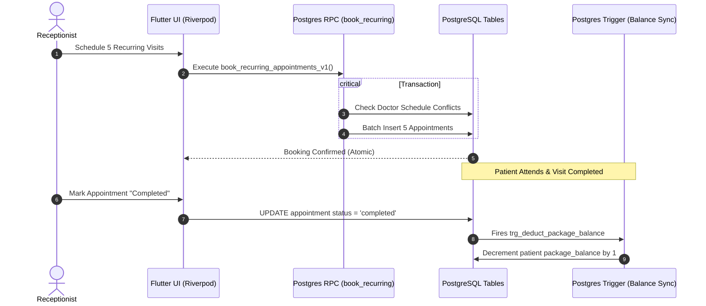

<div align="center">

# 🏥 The Spine Clinic
### **Enterprise Clinical Operations & Patient Management System**

An enterprise-grade, multi-role medical clinic management platform engineered with **Flutter**, **Riverpod**, and **Supabase (PostgreSQL)**. Designed for real-world healthcare operations, featuring strict **Clean Architecture**, database-level transactional integrity, and role-based access control (RBAC).

[](https://flutter.dev)
[](https://dart.dev)
[](https://riverpod.dev)
[](https://supabase.com)
[](#-system-architecture)
[](#-database--security-engineering)
[](#)

[Overview](#-executive-overview) •
[Role Portals](#-role-based-clinical-portals) •
[Architecture](#-system-architecture) •
[Database Engineering](#-database--security-engineering) •
[Tech Stack](#-tech-stack) •
[Quick Start](#-quick-start--setup) •
[Testing](#-testing--quality-assurance)

</div>

---

## 📌 Executive Overview

**The Spine Clinic** is a production-style healthcare operations application built to streamline end-to-end clinical workflows across reception desks, treatment rooms, and administrative leadership.

Unlike generic starter templates, this application is engineered like a real-world enterprise product:
* **Business-Critical Integrity**: Financial ledger updates, package quota deductions, and cancellation refunds are enforced through **atomic PostgreSQL database triggers**.
* **Zero UI-Data Coupling**: Presentation widgets contain zero direct database queries—all state transitions and asynchronous I/O flow through type-safe **Riverpod Notifiers** and **Repository interfaces**.
* **Strict Role-Based Security**: Receptionists, Doctors, and Super Administrators operate within isolated permissions enforced at both the application router and **PostgreSQL Row Level Security (RLS)** layers.

---

## 🎯 Role-Based Clinical Portals

```
┌─────────────────────────────────────────────────────────────────────────┐
│                           THE SPINE CLINIC                              │
├───────────────────┬───────────────────────────┬─────────────────────────┤
│  🩺 DOCTOR DESK   │  📋 RECEPTIONIST WORKDESK │  🛡️ ADMIN GOVERNANCE   │
├───────────────────┼───────────────────────────┼─────────────────────────┤
│ • Daily Queue     │ • Live Schedule Board     │ • Staff Onboarding      │
│ • Patient Dossier │ • Single/Recurring Booking│ • RBAC & Permissions    │
│ • SOAP Notes      │ • Conflict Resolution     │ • Financial Auth        │
│ • Document Vault  │ • Package Quota Sync      │ • Operational Analytics │
│ • Reassignments   │ • POS Invoicing & Dues    │ • Branch Management     │
└───────────────────┴───────────────────────────┴─────────────────────────┘
```

### 🩺 Doctor Workstation
* **Live Patient Queue**: Real-time daily worklist showing upcoming appointments, check-in statuses, and patient details.
* **Longitudinal Patient Dossier**: Instant clinical history access, including past visits, diagnostic notes, active treatment plans, and emergency contacts.
* **SOAP Clinical Notes**: Structured digital charting interface supporting Subjective, Objective, Assessment, and Plan documentation.
* **Private Medical Document Vault**: In-app encrypted rendering of patient imaging, X-rays, and PDF laboratory reports via `pdfrx` with zero local disk leakage.
* **Patient Reassignment Safety**: Seamless handoff workflows to assign patients or individual appointments to colleague physicians.

### 📋 Receptionist Operations Desk
* **Interactive Booking Workboard**: Dynamic schedule matrix displaying single and multi-slot appointments with real-time doctor availability checking.
* **Recurring Appointment Engine**: Multi-week recurring schedule creation powered by transactional Supabase RPCs with automatic conflict rollback.
* **Smart Package Balance Deduction**: Automatic detection and verification of prepaid package credits before confirming bookings.
* **Patient Onboarding & Rapid Search**: Debounced search (300ms) across patient names, phone numbers, and IDs with instant registration.
* **Point-of-Sale (POS) & Due Tracking**: Collect session payments, record package credit top-ups, and track outstanding patient balances with immutable audit logs.

### 🛡️ Super Admin Control Center
* **Role-Based Access Control (RBAC)**: Manage user roles across the clinic with instant account activation, deactivation, and role switching.
* **Granular Financial Permissions**: Explicitly gate payment collection and financial auditing capabilities per staff member.
* **Clinic Analytics**: Track attendance rates, doctor utilization, appointment status distributions, and revenue flows.
* **Multi-Branch Segregation**: Organize clinicians, staff, and appointments across multiple physical facility locations.

---

## 🏛️ System Architecture

The codebase follows **Feature-First Clean Architecture**, separating business logic, state orchestration, and data access into strict unidirectional layers.

```
┌────────────────────────────────────────────────────────────────────────┐
│                        PRESENTATION LAYER                              │
│    UI Screens • Reusable Widgets • Riverpod Code-Gen Notifiers         │
└───────────────────────────────────┬────────────────────────────────────┘
                                    │ (Dispatches User Actions / Watches State)
                                    ▼
┌────────────────────────────────────────────────────────────────────────┐
│                          DOMAIN LAYER                                  │
│    Freezed Entities • Repository Interfaces • Result<T> Monad          │
└───────────────────────────────────┬────────────────────────────────────┘
                                    │ (Calls Abstract Contracts)
                                    ▼
┌────────────────────────────────────────────────────────────────────────┐
│                           DATA LAYER                                   │
│    Repository Implementations • Data Transfer Objects (DTOs)          │
└───────────────────────────────────┬────────────────────────────────────┘
                                    │ (Invokes Network Client)
                                    ▼
┌────────────────────────────────────────────────────────────────────────┐
│                      SUPABASE / POSTGRESQL                             │
│    Postgres Triggers • ACID RPCs • Row Level Security • S3 Storage     │
└────────────────────────────────────────────────────────────────────────┘
```

### 💎 Key Software Engineering Pillars
* **Type-Safe Asynchronous I/O (`Result<T>`)**: Asynchronous repository methods return a functional `Result<T>` (`Success<T>` | `Failure<AppException>`) rather than throwing raw unhandled exceptions.
* **Immutable State Management**: All domain models and UI states use `@freezed` and `@riverpod` code generation with defensive `copyWith` mutations.
* **Design Token System**: 100% theme-driven architecture (`AppSizes`, `AppTextStyles`, `Theme.of(context)`). Zero hardcoded dimensions or colors to guarantee seamless Light/Dark mode and responsiveness.
* **Ergonomic Touch UX**: Adheres to a phone-first interaction model with $\ge 44\text{px}$ touch targets, smooth bottom sheets, and mandatory 4-state UI handling (`Loading`, `Error`, `Empty`, `Data`).

---

## 🔒 Database & Security Engineering

The PostgreSQL backend acts as the definitive system of record, embedding business logic directly into database triggers and security policies.



* **Automated Balance Triggers**: Completing an appointment decrements the patient's package credit; cancelling or deleting automatically restores the balance.
* **ACID Transactional RPCs**: Complex recurring schedules are booked atomically via stored procedures (`book_recurring_appointments_v1`), rolling back the entire batch if any conflict occurs.
* **Row-Level Security (RLS)**: Fine-grained policies ensure doctors only read their assigned patients, receptionists manage daily clinic flow, and admins oversee financials.
* **Private S3-Compatible Storage**: Medical imaging and sensitive lab reports reside in the private `patient-documents` bucket protected by authenticated Supabase storage policies.

---

## 🛠️ Tech Stack

| Domain | Technology / Library | Purpose |
| :--- | :--- | :--- |
| **Framework** | [Flutter](https://flutter.dev) (v3.x) & [Dart](https://dart.dev) (v3.x) | Cross-platform client application |
| **State Management** | [Flutter Riverpod](https://pub.dev/packages/flutter_riverpod) + `riverpod_generator` | Reactive, compile-safe dependency injection & state |
| **Backend & Database** | [Supabase](https://supabase.com) (PostgreSQL 15+) | Auth, PostgreSQL database, RLS, Realtime & Storage |
| **Navigation** | [GoRouter](https://pub.dev/packages/go_router) | Declarative routing with authenticated redirect guards |
| **Data Modeling** | [Freezed](https://pub.dev/packages/freezed) & `json_serializable` | Immutable value objects and JSON serialization |
| **Document Rendering** | [Pdfrx](https://pub.dev/packages/pdfrx) | High-performance in-app PDF medical viewer |
| **UI & Animation** | `flutter_animate`, `flutter_lucide`, `google_fonts` | Smooth transitions and modern Material 3 typography |
| **Hosting & Delivery** | [Firebase Hosting](https://firebase.google.com/docs/hosting) | Production web distribution |

---

## 📂 Project Structure

```text
lib/
├── core/
│   ├── constants/         # AppSizes, AppStrings, AppTextStyles, AppTheme
│   ├── errors/            # Result<T>, AppException, Failure contracts
│   ├── network/           # SupabaseService, GoRouter, Route guards
│   └── utils/             # Formatters, local storage, document helpers
├── shared/
│   └── widgets/           # AppButton, AppTextField, AppBottomSheet, ErrorView, EmptyState
└── features/
    ├── admin/             # Staff management, analytics, clinic configuration
    ├── appointment/       # Booking workboard, schedule calendar, recurring visits
    ├── auth/              # Authentication, session validation, registration
    ├── medical_records/   # Clinical notes (SOAP), document vault, file viewers
    ├── patient/           # Patient directory, dossier tabs, profile editing
    ├── payments/          # Payment recording, package credit sync, due collections
    └── staff/             # Clinician directories, account activation, doctor search
supabase/
├── migrations/            # Versioned SQL migrations (RLS, triggers, schema)
└── full_schema.sql        # Canonical database DDL baseline
```

---

## 🚀 Quick Start & Setup

### Prerequisites
* [Flutter SDK](https://docs.flutter.dev/get-started/install) (`>= 3.10.0`)
* [Supabase CLI](https://supabase.com/docs/guides/cli) or an active Supabase project

### 1. Clone & Install Dependencies
```bash
git clone https://github.com/saagy/theSpineClinic.git
cd theSpineClinic
flutter pub get
```

### 2. Configure Environment Variables
Copy `.env.example` to `.env` and provide your project keys:
```bash
cp .env.example .env
```
```env
SUPABASE_URL=https://your-project.supabase.co
SUPABASE_ANON_KEY=your-anon-key-here
```

### 3. Run with Secure Compile-Time Flags
Pass configuration via `--dart-define` to ensure keys are not bundled in clear-text web assets:
```bash
flutter run \
  --dart-define=SUPABASE_URL=https://your-project.supabase.co \
  --dart-define=SUPABASE_ANON_KEY=your-anon-key-here
```

### 4. Code Generation (When Modifying Models/Providers)
```bash
dart run build_runner build --delete-conflicting-outputs
```

---

## 🧪 Testing & Quality Assurance

The codebase enforces strict static analysis and comprehensive automated tests across client logic and database triggers.

```bash
# 1. Static Analysis (Zero Warnings / Zero Errors policy)
flutter analyze

# 2. Run Unit & Widget Test Suite
flutter test

# 3. Verify Database Balance Triggers (Rollback-safe SQL script)
psql "$DATABASE_URL" -f test/trigger_sanity.sql
```

---

## 📚 In-Depth Technical Documentation

For deeper architectural and database specifications, refer to the technical docs:
* 📖 [Database Overview](docs/database-overview.md) — System of record architecture and data models.
* 📋 [Schema Reference](docs/schema-reference.md) — Exhaustive table schema, triggers, and RPC documentation.
* 🔐 [Security & RLS Model](docs/security-model.md) — Role policies, auth tokens, and private storage rules.
* ⚙️ [Development Workflow](docs/development-workflow.md) — Branching, migrations, and local workflows.

---

<div align="center">
  <sub>Built with ❤️ for modern healthcare operations. Designed and engineered for speed, reliability, and clinical clarity.</sub>
</div>

