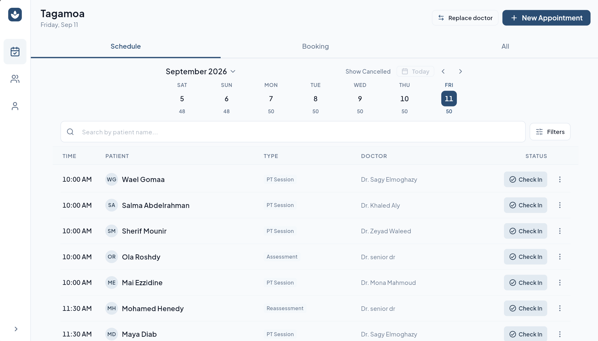
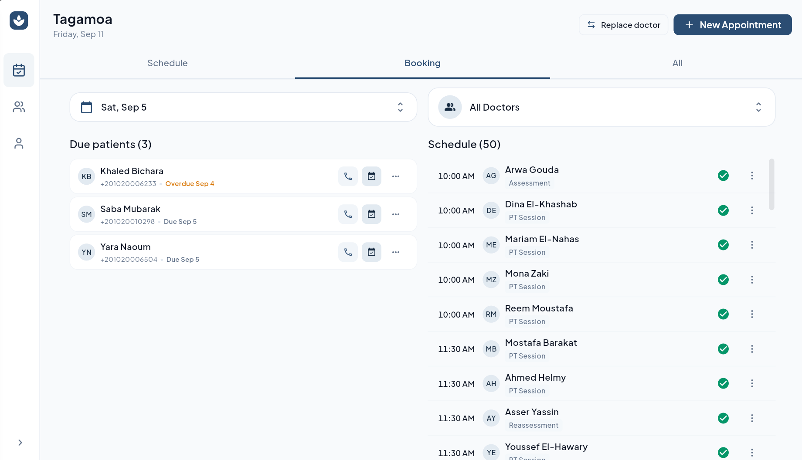
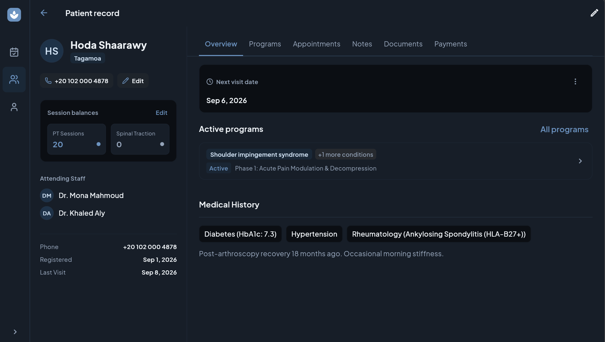
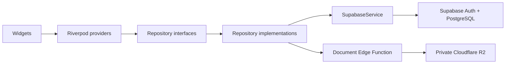

# The Spine Clinic

Clinic management for the people coordinating care.

A Flutter application that brings appointments, patient records, treatment programs, and payments into one workspace. Receptionists coordinate schedules and follow-ups; doctors review patients and document care; administrators manage staff and operational access.

Built for phone and desktop layouts, with role-aware workflows and light and dark themes.

[Engineering](#engineering-decisions) · [Run locally](#run-locally) · [Documentation](docs/README.md) · [Contact](#author)



*The reception schedule keeps appointment times, patients, clinicians, and status actions together in a scannable desktop table.*

## Product walkthrough

| Workflow | What the application supports |
| --- | --- |
| Coordinate appointments | Branch schedules, single and recurring bookings, doctor assignments, and appointment status changes. |
| Follow up with patients | Due-patient queues with contact and booking actions alongside the selected day's schedule. |
| Review a patient | A workspace connecting medical history, programs, appointments, notes, documents, and payments. |
| Document treatment | Clinical programs, assessments, treatment plans, and patient documents. |
| Track payments and sessions | Payment recording, outstanding dues, collection actions, and physical therapy / traction balances. |
| Manage access | Staff activation, doctor and senior-doctor workflows, and permission-controlled payment actions. |

<details>
<summary><strong>More screenshots — booking and the patient workspace</strong></summary>

### Booking workboard

Due patients and the day's appointments sit side by side, so reception can follow up without losing scheduling context.



### Patient workspace in dark mode

Patient identity, session balances, and attending staff remain visible while the main area presents programs and medical history.



</details>

## Engineering decisions

The most interesting work is where scheduling, access permissions, and financial state intersect.

- **Keep related writes atomic.** PostgreSQL RPCs handle recurring bookings and patient edits with assignments in one transaction. Financial triggers reconcile session charges when appointments change; due collection locks the payment row before updating it.
- **Enforce access beyond the interface.** Controllers check the current staff profile before mutations; PostgreSQL row-level security and permission-checked functions enforce database access. Receptionist payment writes require a separate permission.
- **Make async failures explicit.** Repository operations use `Result<T>` so providers can expose success and failure states. Generated Riverpod providers coordinate shared state, while immutable updates preserve unrelated fields during partial changes.
- **Separate document metadata from objects.** PostgreSQL stores metadata; a Supabase Edge Function authorizes private Cloudflare R2 objects. Failed metadata creation triggers upload cleanup; deletion removes database records before best-effort object cleanup.
- **Adapt to the workspace.** Shared tokens support light/dark themes and responsive layouts. Wide screens use tables and persistent patient context; interactive searches debounce network queries.

### Architecture



Features use presentation, domain, and data layers. Shared UI lives in `lib/shared/widgets/`; themes, errors, and network infrastructure live in `lib/core/`. The staff feature's domain-layer extraction remains a documented follow-up.

### Stack

| Area | Tools |
| --- | --- |
| Client | Flutter, Dart |
| State and models | Riverpod code generation, Freezed, JSON serialization |
| Navigation | GoRouter |
| Backend | Supabase Auth, PostgreSQL, RLS, RPCs and triggers |
| Documents | Supabase Edge Functions, Cloudflare R2, pdfrx |
| Delivery and checks | Firebase Hosting, GitHub Actions, Flutter tests, Node tests, isolated PostgreSQL tests |

For a closer code review, start with [appointments](lib/features/appointment/), [payments](lib/features/payments/), [database migrations](supabase/migrations/), or the [document authorization handler](supabase/functions/document-storage/handler.ts).

## Run locally

### Prerequisites

- Flutter **3.44.1**, pinned in the repository's review workflow. The package requires Dart **>=3.10.0 <4.0.0**.
- Chrome for the web target.
- Your own Supabase project for authentication and application data.

### 1. Get the client

```sh
git clone https://github.com/saagy/theSpineClinic.git
cd theSpineClinic
flutter pub get
```

Copy `.env.example` to `.env` and replace both placeholders with your project's URL and public anon key. The file must exist because it is declared as a Flutter asset.

```dotenv
SUPABASE_URL=https://your-project.supabase.co
SUPABASE_ANON_KEY=your-supabase-anon-key
```

Configuration resolves from `--dart-define` values, then `.env`, then compiled defaults. Set your own values explicitly to avoid connecting to the default project. Both bundled assets and compile-time client configuration are public: never put service-role keys, database passwords, or R2 secrets in either.

### 2. Prepare the backend

For a **fresh Supabase project**, apply [`supabase/full_schema.sql`](supabase/full_schema.sql) using the SQL editor. Existing databases require incremental migrations instead. See the [database setup and migration notes](docs/database-overview.md).

Operational screens require an authenticated, active staff profile with the appropriate role. Self-registration creates an inactive application; a project administrator must bootstrap the first administrator and activate staff. This is a connected application without a bundled offline demo account.

Documents additionally require the [`document-storage` Edge Function](supabase/functions/document-storage/) and a private R2 bucket. Configure `R2_ACCOUNT_ID`, `R2_BUCKET_NAME`, `R2_ACCESS_KEY_ID`, and `R2_SECRET_ACCESS_KEY` as server-side function secrets, plus browser CORS for your app origin. See the [document security model](docs/security-model.md#documents).

### 3. Generate and run

```sh
dart run build_runner build --delete-conflicting-outputs
flutter run -d chrome
```

Further development and deployment conventions are in [CONTRIBUTING.md](CONTRIBUTING.md).

## Validation

```sh
flutter analyze
flutter test
flutter build web --release
```

The [review workflow](.github/workflows/web-review.yml) also runs document-handler security tests and SQL regression scripts against isolated PostgreSQL, using both the schema snapshot and migration replay.

Tests cover access boundaries, financial reconciliation, booking integrity, and provider/widget behavior. Isolated backend tests substitute for hosted services; they do not establish deployed configuration or full browser acceptance. Commands and boundaries are in [the testing guide](docs/testing.md).

## Project status

Actively developed. Screenshots show the current desktop interface; the [hosted web application](https://spine-clinic-app.web.app/) may differ from this checkout and requires staff access.

Release acceptance and remaining issues are tracked in the [review results](docs/pre-delivery-review-results.md) and [client review checklist](docs/client-review-checklist.md). Password recovery screens remain deferred.

## Documentation

- [Architecture](docs/architecture.md) — layers, providers, and routing.
- [Database schema](docs/database-schema.md) — tables, functions, triggers, and policies.
- [Security model](docs/security-model.md) — staff permissions and document access.
- [Testing](docs/testing.md) — client and backend verification.
- [Design system](DESIGN.md) — visual direction and component conventions.

## Author

**Sagy Tamer · Mobile Software Engineer**

[LinkedIn](https://www.linkedin.com/in/sagy-tamer/) · [GitHub](https://github.com/saagy) · [Email](mailto:sagyelmoghazy1@gmail.com)
